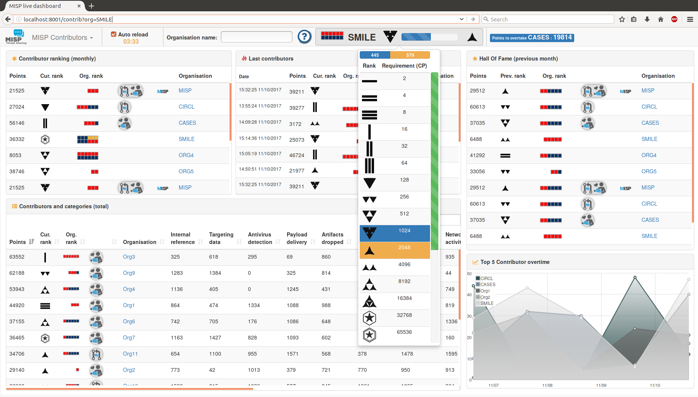
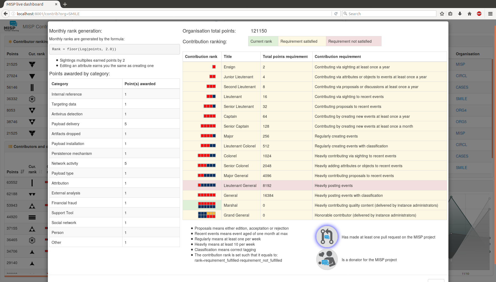
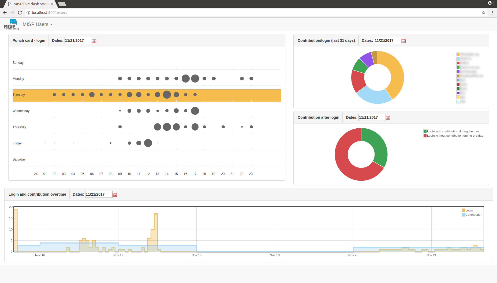

# misp-dashboard

A dashboard showing live data and statistics from the ZMQ feeds of one or more [MISP](https://www.misp-project.org/) instances. The dashboard
can be used as a real-time situational awareness tool to gather threat intelligence information. The misp-dashboard includes
a gamification tool to show the contributions of each organisations and how they are ranked over time. The dashboard can be used for
SOC (Security Operation Center), security team or during cyber exercise to keep track of what's going on your various MISP instances.

# Features

## Live Dashboard

- Possibility to subscribe to multiple ZMQ feeds
- Shows direct contribution made by organisations
- Shows live resolvable posted locations


## Geolocalisation Dashboard

- Provides historical geolocalised information to support security teams, CSIRTs or SOC finding threats in their constituency
- Possibility to get geospatial information from specific regions


## Contributors Dashboard

__Shows__:
- The monthly rank of all organisation
- The last organisation that contributed (dynamic updates)
- The contribution level of all organisation
- Each category of contribution per organisation
- The current ranking of the selected organisation (dynamic updates)

__Includes__:

- Gamification of the platform:
  - Two different levels of ranking with unique icons
  - Exclusive obtainable badges for source code contributors and donator




## Users Dashboard

- Shows when and how the platform is used:
    - Login punchcard and overtime
    - Contribution vs login



## Trendings Dashboard

- Provides real time information to support security teams, CSIRTs or SOC showing current threats and activity
    - Shows most active events, categories and tags
    - Shows sightings and discussion overtime


# Installation
- Launch ```./install_dependencies.sh``` from the MISP-Dashboard directory
- Update the configuration file ```config.cfg``` so that it matches your system
  - Fields that you may change:
    - RedisGlobal -> host
    - RedisGlobal -> port
    - RedisGlobal -> zmq_url
    - RedisGlobal -> misp_web_url
    - RedisMap    -> pathMaxMindDB

# Updating by pulling
- Re-launch ```./install_dependencies.sh``` to fetch new required dependencies
- Re-update your configuration file ```config.cfg```

:warning: Make sure no zmq python3 scripts are running. They block the update.

```python
+ virtualenv -p python3 DASHENV
Already using interpreter /usr/bin/python3
Using base prefix '/usr'
New python executable in /home/steve/code/misp-dashboard/DASHENV/bin/python3
Traceback (most recent call last):
  File "/usr/bin/virtualenv", line 9, in <module>
    load_entry_point('virtualenv==15.0.1', 'console_scripts', 'virtualenv')()
  File "/usr/lib/python3/dist-packages/virtualenv.py", line 719, in main
    symlink=options.symlink)
  File "/usr/lib/python3/dist-packages/virtualenv.py", line 942, in create_environment
    site_packages=site_packages, clear=clear, symlink=symlink))
  File "/usr/lib/python3/dist-packages/virtualenv.py", line 1261, in install_python
    shutil.copyfile(executable, py_executable)
  File "/usr/lib/python3.5/shutil.py", line 115, in copyfile
    with open(dst, 'wb') as fdst:
OSError: [Errno 26] Text file busy: '/home/steve/code/misp-dashboard/DASHENV/bin/python3'
```

# Starting the System
:warning: You do not need to run it as root. Normal privileges are fine.

- Be sure to have a running redis server
    - e.g. ```redis-server --port 6250```
- Activate your virtualenv ```. ./DASHENV/bin/activate```
- Listen to the MISP feed by starting the zmq_subscriber ```./zmq_subscriber.py &```
- Start the dispatcher to process received messages ```./zmq_dispatcher.py &```
- Start the Flask server ```./server.py &```
- Access the interface at ```http://localhost:8001/```

# Debug

Debug is fun and gives you more details on what is going on when things fail.
Bare in mind running Flask in debug is NOT suitable for production, it will drop you to a Python shell if enabled, to do further digging.

Just before running ./server.py do:

```
export FLASK_DEBUG=1
export FLASK_APP=server.py
flask run --host=0.0.0.0 --port=8001 # <- Be careful here, this exposes it on ALL ip addresses. Ideally if run locally --host=127.0.0.1
```

OR, just toggle the debug flag in start_all.sh script.

Happy hacking ;)


# zmq_subscriber options
```usage: zmq_subscriber.py [-h] [-n ZMQNAME] [-u ZMQURL]

A zmq subscriber. It subscribe to a ZMQ then redispatch it to the MISP-dashboard

optional arguments:
  -h, --help            show this help message and exit
  -n ZMQNAME, --name ZMQNAME
                        The ZMQ feed name
  -u ZMQURL, --url ZMQURL
                        The URL to connect to
```

# Deploy in production using mod_wsgi

Install Apache's mod-wsgi for Python3

```bash
sudo apt-get install libapache2-mod-wsgi-py3
```

Caveat: If you already have mod-wsgi installed for Python2, it will be replaced!

```bash
The following packages will be REMOVED:
  libapache2-mod-wsgi
The following NEW packages will be installed:
  libapache2-mod-wsgi-py3
```

Configuration file `/etc/apache2/sites-available/misp-dashboard.conf` assumes that `misp-dashboard` is cloned into `var/www/misp-dashboard`. It runs as user `misp` in this example. Change the permissions to folder and files accordingly.

```
<VirtualHost *:8000>
    ServerAdmin admin@misp.local
    ServerName misp.local

    DocumentRoot /var/www/misp-dashboard
    
    WSGIDaemonProcess misp-dashboard \
       user=misp group=misp \
       python-home=/var/www/misp-dashboard/DASHENV \
       processes=1 \
       threads=15 \
       maximum-requests=5000 \
       listen-backlog=100 \
       queue-timeout=45 \
       socket-timeout=60 \
       connect-timeout=15 \
       request-timeout=60 \
       inactivity-timeout=0 \
       deadlock-timeout=60 \
       graceful-timeout=15 \
       eviction-timeout=0 \
       shutdown-timeout=5 \
       send-buffer-size=0 \
       receive-buffer-size=0 \
       header-buffer-size=0 \
       response-buffer-size=0 \
       server-metrics=Off

    WSGIScriptAlias / /var/www/misp-dashboard/misp-dashboard.wsgi

    <Directory /var/www/misp-dashboard>
        WSGIProcessGroup misp-dashboard
        WSGIApplicationGroup %{GLOBAL}
        Require all granted
    </Directory>

    LogLevel info
    ErrorLog /var/log/apache2/misp-dashboard.local_error.log
    CustomLog /var/log/apache2/misp-dashboard.local_access.log combined
    ServerSignature Off
</VirtualHost>
```

# License

Images and logos are handmade for:
- rankingMISPOrg/
- rankingMISPMonthly/
- MISPHonorableIcons/

Note that:
- Part of ```MISPHonorableIcons/1.svg``` comes from [octicons.github.com](https://octicons.github.com/icon/git-pull-request/) (CC0 - No Rights Reserved)
- Part of ```MISPHonorableIcons/2.svg``` comes from [Zeptozephyr](https://zeptozephyr.deviantart.com/art/Vectored-Portal-Icons-207347804) (CC0 - No Rights Reserved)
- Part of ```MISPHonorableIcons/3.svg``` comes from [octicons.github.com](https://octicons.github.com/icon/git-pull-request/) (CC0 - No Rights Reserved)
- Part of ```MISPHonorableIcons/4.svg``` comes from [Zeptozephyr](https://zeptozephyr.deviantart.com/art/Vectored-Portal-Icons-207347804) & [octicons.github.com](https://octicons.github.com/icon/git-pull-request/) (CC0 - No Rights Reserved)
- Part of ```MISPHonorableIcons/5.svg``` comes from [Zeptozephyr](https://zeptozephyr.deviantart.com/art/Vectored-Portal-Icons-207347804) & [octicons.github.com](https://octicons.github.com/icon/git-pull-request/) (CC0 - No Rights Reserved)

```
Copyright (C) 2017-2018 CIRCL - Computer Incident Response Center Luxembourg (c/o smile, security made in Lëtzebuerg, Groupement d'Intérêt Economique)
Copyright (c) 2017-2018 Sami Mokaddem


This program is free software: you can redistribute it and/or modify
it under the terms of the GNU Affero General Public License as published by
the Free Software Foundation, either version 3 of the License, or
(at your option) any later version.

This program is distributed in the hope that it will be useful,
but WITHOUT ANY WARRANTY; without even the implied warranty of
MERCHANTABILITY or FITNESS FOR A PARTICULAR PURPOSE.  See the
GNU Affero General Public License for more details.

You should have received a copy of the GNU Affero General Public License
along with this program.  If not, see <http://www.gnu.org/licenses/>.
```
